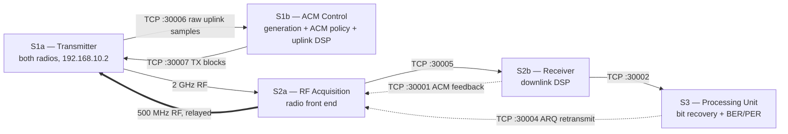

# DVB-S2 Satellite Testbed — Architecture & Function Map

A working inventory of the five processes that make up the testbed's live signal
chain and the functions each one calls — organised by role: downlink physical
layer, uplink physical layer, TCP transport, message serialization, and
testbed / ACM control. Sections 3 and 4 explain the two standards this
testbed implements — DVB-S2 for the forward link, CCSDS Telecommand for the
return link — and map each one directly onto the functions that implement it.

**Platform:** MATLAB R2026a
**Hardware:** NI USRP-2920 (downlink TX + uplink RX, `192.168.10.2`) · USRP-2922 (`192.168.10.3`)

**A note on paths below:** every script and `Functions/` path in this
document (and in `sdr_test/`) is relative to the repo's `Testbed/` folder,
e.g. `Functions/dvbs2FrameSync.m` means `Testbed/Functions/dvbs2FrameSync.m`
on disk. The root of the repo holds only this documentation and the two
PowerShell launcher scripts, not MATLAB source.

---

## 1 · System overview

The testbed splits one DVB-S2 forward link and one CCSDS Telecommand return
link across five MATLAB processes, each its own script, talking over TCP on
loopback. Splitting the chain this way means each process can be started
independently, in any order, and — on the hardware runs — each maps onto a
distinct piece of the RF path rather than one script trying to own both
radios at once.

The two radios are not symmetric. **USRP-2920** carries the downlink transmit
chain at 2 GHz *and* the uplink receive chain at 500 MHz — the same physical
device, the same IP address, `192.168.10.2` — because the ground station only
has the one antenna feed on that side. **USRP-2922** is free-standing at
`192.168.10.3`. That constraint is why both radios stay inside
`S1a_Transmitter.m` rather than being split across two processes: nothing
else is allowed to open that IP.

Downlink generation and ACM control used to live in that same process too,
until measurement showed the combination cost more than it saved (see
[§9](#9--testbed--acm-control--functionstestbed)'s "how ACM works" section for
the full history). `S1a_Transmitter.m` was pared back to radio I/O only —
both radios, and nothing else — with everything that decides *what* to
transmit split out into `S1b_ACMControl.m`: the waveform generator, the
transmit FIFO, ACM policy, and the CCSDS uplink receive chain.



All TCP ports are configured once, in `dvbs2TestbedConfig.m`, as `host:port`
pairs. Which physical process binds a given port changes between simulated
and hardware runs — in RF mode, S2a takes over the two ports S1b used to
host directly — but the scripts that connect to them never need to know
that; see [§9](#9--testbed--acm-control--functionstestbed).

---

## 2 · The processes

Five scripts run today, one per MATLAB window, each started independently
and in any order — every TCP client in this testbed retries its connect
until the corresponding server is up, so there is no required startup
sequence.

### `S1a_Transmitter.m` — Radio I/O only
Owns both radios — downlink TX at 2 GHz and uplink RX at 500 MHz — because
they share one IP and physically cannot be split across two processes.
Generates nothing of its own: every transmitted sample comes from S1b over
the TX-block link, and every received uplink sample is forwarded to S1b
unprocessed. If S1b doesn't have a block ready in time, S1a falls back to
transmitting a locally-synthesized dummy PLFRAME rather than let the radio
go silent (see [§9](#9--testbed--acm-control--functionstestbed)'s ACM
write-up, point 7).
Ports: TX 2 GHz / RX 500 MHz (`192.168.10.2`), server `:30007` (TX blocks
in, from S1b), client `:30006`\* (raw uplink samples out, to S1b).

### `S1b_ACMControl.m` — Waveform generation, ACM control, and uplink decoding
S1b owns the functions that determine **what should be transmitted** and how
the system reacts to link-quality feedback. It contains the DVB-S2 waveform
generator, transmit FIFO, ACM policy, selective-repeat ARQ retransmission
queue, and CCSDS Telecommand uplink decoder.

S1b does not access either USRP directly. S1a remains responsible for both
radio interfaces because the downlink transmitter and uplink receiver share
the same USRP-2920 and IP address. S1b exchanges data with S1a over TCP:
generated downlink sample blocks are sent to S1a, while raw uplink samples
are received from S1a in RF mode.

The uplink decoder is split between the two processes. S1a performs the
radio-adjacent acquisition stages and forwards candidate CLTUs after ASM
correlation. S1b performs the later derandomization and LDPC decoding stages,
then parses the decoded command. This keeps continuous sample-rate work close
to the radio while placing the occasional command decoding and control logic
in S1b.

Since S1b no longer calls the blocking radio-transmit API, it cannot use that
API as an implicit real-time clock. It therefore uses explicit wall-clock
pacing and a one-block look-ahead buffer. S1a retains a bounded local
dummy-filler fallback so a temporary generation delay does not immediately
leave the transmitter without samples.

Ports: client `:30007` (TX blocks to S1a), server `:30006`* (raw uplink
samples from S1a, RF mode only), and—when S1b hosts the control listeners—
servers `:30001`** and `:30004`**.

### `S2a_RFAcquisition.m` — Downlink front end
The only process that touches the receive radio. Runs DC-offset/AGC
conditioning on the raw 2 GHz samples and forwards fixed-length chunks to S2b
for DSP. In hardware mode it also becomes the return-link gateway: it hosts
the ACM-feedback and retransmit-request listeners and relays whatever
arrives on them, verbatim, over the 500 MHz uplink carrier to S1a.
Ports: server `:30005`, server `:30001`\*\*, server `:30004`\*\*.

### `S2b_Reciever.m` — Downlink DSP
The physical-layer receive chain: frame sync, matched filtering with Gardner
timing recovery, coarse/fine CFO estimation, PLHEADER/PLSC recovery,
pilot-aided phase compensation, per-frame SNR estimation, and the
frame-acceptability screen. Hands off corrected PLFRAMEs to S3 and reports
channel quality back toward S1b.
Ports: client `:30001`, client `:30002`.

### `S3_ProcessingUnit.m` — Bit recovery
LDPC/BCH decoding and BBHEADER/packet extraction, plus the testbed's
independent measurement point: per-packet CRC-8, and self-synchronizing
BER/PER against a deterministic reference payload. Detects gaps and CRC
failures and drives the selective-repeat ARQ logic that requests their
retransmission.
Ports: server `:30002`, client `:30004`.

\* In simulated (non-RF) mode there is no uplink radio to carry samples
between S1a and S1b, so this pair of ports is not used at all — S1b hosts
the ACM-feedback and retransmit-request listeners (`:30001`/`:30004`)
directly instead, in the same role S2a takes over in RF mode.

\*\* In simulated (non-RF) mode these two servers are hosted by S1b
directly, and S2a's radio/relay code does not run at all.

---

## 3 · The DVB-S2 standard, and where it's implemented

DVB-S2 (ETSI EN 302 307-1) is the physical-layer standard this testbed uses
for the **forward link** — S1a to S2a/S2b/S3, 2 GHz. It defines how bits
become a transmittable signal, and it is built to run under **adaptive
coding and modulation (ACM)**: the transmitter can change modulation and
code rate frame by frame to match the channel, without the receiver being
told out of band — because every frame announces its own format inline.

**The PLFRAME.** Every transmitted unit is one PLFRAME, built from three
parts:

```
┌──────────────┬───────────────────────┬────────┬─────┬────────┐
│   PLHEADER    │      XFECFRAME data    │ pilot  │ ... │ pilot  │
│  90 symbols   │  (LDPC/BCH-coded bits, │ block  │     │ block  │
│ 26 SOF+64 PLSC│   mapped to symbols)   │ 36 sym │     │ 36 sym │
└──────────────┴───────────────────────┴────────┴─────┴────────┘
```

- **PLHEADER** — 90 π/2-BPSK symbols, sent in the clear (unscrambled), split
  into a 26-symbol **SOF** (Start Of Frame — always the same pattern, what
  the receiver correlates against to find the frame at all) and a
  64-symbol **PLSC** (PL Signalling Code), a Reed-Muller codeword that
  tells the receiver, before it has decoded a single data bit, exactly what
  MODCOD, FEC length and pilot configuration to expect for the rest of the
  frame.
- **XFECFRAME** — the coded payload. One LDPC/BCH-coded block, fixed at
  **64800 bits** (this testbed rejects the standard's alternate 16200-bit
  "short" FECFRAME — see `dvbs2FrameAcceptable.m`), mapped onto the
  constellation the PLSC just announced: 2 bits/symbol for QPSK, 3 for
  8PSK, 4 for 16APSK, 5 for 32APSK.
- **Pilot blocks** — optional 36-symbol known sequences inserted every 16
  data slots (a slot = 90 symbols), used for carrier/phase tracking, absent
  when `HasPilots = false`.

Put together (`dvbs2FrameLength.m`), a complete PLFRAME is:

| MODCOD family | XFECFRAME symbols | Pilot blocks | **Total PLFRAME (symbols)** |
|---|---:|---:|---:|
| QPSK   | 32400 | 22 | **33282** |
| 8PSK   | 21600 | 14 | **22194** |
| 16APSK | 16200 | 11 | **16686** |
| 32APSK | 12960 |  8 | **13338** |

Higher-order modulations pack the same 64800 coded bits into fewer symbols
— that is literally what buys the throughput, at the cost of needing more
SNR to place each symbol correctly.

**Where each part of the standard is implemented.** This is the same chain
as [§5](#5--downlink-functions--functionsm), organised by what it's doing
rather than by filename:

| Standard concept | Implemented by |
|---|---|
| Symbol timing recovery (matched filter + Gardner) | `dvbs2MatchedFilterTimingSync.m` |
| Locating the PLHEADER in a stream of samples | `dvbs2FrameSync.m`, `dvbs2SOFReference.m` |
| Coarse carrier-frequency acquisition | `dvbs2CoarseFreqEst.m`, `lrEstimate.m`, `dvbs2RawCFOCompensate.m` (currently disabled) |
| Fine carrier-frequency tracking | `dvbs2FineFreqEst.m`, `dvbs2CFOTracker.m` |
| PLSC decode → MODCOD / FEC length / pilots | `dvbs2PLHeaderRecover.m`, `dvbs2PLHeaderReference.m` |
| Pilot-block generation & phase correction | `dvbs2PilotStructure.m`, `dvbs2PhaseCompensate.m` |
| Phase correction when a frame has no pilots | `dvbs2NonPilotFineFreqPhase.m` |
| PLFRAME length bookkeeping | `dvbs2FrameLength.m`, `getDFL.m` |
| Per-frame SNR measurement (feeds ACM and LLR scaling) | `dvbs2SNREstimate.m` |
| LDPC/BCH decode + BBHEADER/packet extraction | `AEC_dvbs2BitRecover.m` |
| Rejecting frames the transmitter could not have sent | `dvbs2FrameAcceptable.m` *(temporary safety net, meant to be progressively relaxed)* |
| Keeping the carrier alive between real bursts | `dvbs2DummyFiller.m` |
| Simulated-channel testing only | `configureDVBS2Channel.m` |

---

## 4 · The CCSDS Telecommand standard, and where it's implemented

The **return link** — S2b/S3 back to S1b, 500 MHz — carries ACM feedback and
ARQ retransmit requests, not payload data, so it uses a different standard
entirely: **CCSDS 231.0-B, TC Synchronization and Channel Coding**, the
protocol real missions use for ground-to-spacecraft commanding.

**PLOP-2** (Physical Layer Operations Procedure-2) is the standard's
continuous-carrier mode — the carrier is never keyed off, so the receiver's
carrier and timing loops never lose lock waiting for a message. Three
things can be on the air at any moment:

- **Acquisition sequence** — alternating symbols, sent once at session
  start purely so the receiver's loops have something to lock onto.
- **Idle sequence** — the same alternating pattern, sent whenever no
  command is queued. This is what keeps the link "up" with nothing to say.
- **CLTU** (Communications Link Transmission Unit) — start sequence +
  coded codeblock + tail sequence: the thing that actually carries a
  message.

**Coding.** This testbed implements the **LDPC(128,64)** branch of the
standard only (rate 1/2, 128-bit codeword carrying 64 information bits) —
CCSDS also defines a BCH-coded mode with its own start sequence (`EB90`),
deliberately not implemented here rather than half-built
(`ccsdsUplinkFraming.m`). Every ACM feedback report or ARQ retransmit
request — both exactly 5 bytes, 40 bits — fits in one LDPC(128,64)
codeword's 64 information bits.

**Randomizing.** CCSDS mandates a specific scrambling sequence under LDPC
coding — `h(x) = x⁸+x⁶+x⁴+x³+x²+x+1`, all-ones initial state
(`ccsdsUplinkRandomizer.m`) — applied *after* LDPC encoding, to the whole
codeblock. Its job is guaranteeing bit transitions on the air regardless of
payload, so the receiver's timing and carrier recovery keep working even
during a run of identical bytes. The consequence for the receiver: it must
**derandomize before decoding**, not after — a sign flip on every LLR whose
randomizer bit is 1 (`ccsdsUplinkDecodeCodeblock.m`).

**Modulation — the one deliberate deviation from the "textbook" scheme.**
Classic CCSDS Telecommand uses PCM/PSK/PM: data modulates a subcarrier,
which then phase-modulates the RF carrier, leaving a residual unmodulated
carrier tone for the receiver's PLL to lock onto. This testbed uses plain
**suppressed-carrier BPSK, no subcarrier**, because a subcarrier is
designed for a deep-space link with a pointed dish and a phase-locked loop
that cannot afford to lose lock — for a LEO link at 500 MHz it is pure
overhead: it spends roughly half the transmitted power on an unmodulated
tone and triples the occupied bandwidth for no coding gain. Dropping it
moves two problems onto the receiver instead: there is no residual carrier
to FFT-peak-detect any more (a suppressed-carrier BPSK signal has to be
squared first, putting a tone at *twice* the true offset —
`ccsdsUplinkCoarseCFO.m`), and LO leakage now lands inside the signal band
instead of safely off to the side, so DC removal is mandatory
(`ccsdsUplinkDCSuppress.m`).

**Link budget, as actually configured:** 8 ksym/s symbol rate (chosen
freely, since nothing constrains it once there's no subcarrier — halving
the rate is worth 3 dB of noise performance), 200 ksym/s sample rate, 0.35
root-raised-cosine roll-off. At 8 ksym/s an LDPC(128,64) CLTU takes 40 ms
to transmit, over which even the fastest Doppler this link ever sees
(≈190 Hz/s at 500 MHz) rotates the carrier phase by under 8 Hz — negligible
within one codeblock.

**Where each part of the standard is implemented** — numbered to match the
receive chain's actual stage order, same as [§6](#6--uplink-functions--functionsuplinkm):

| Standard concept | Implemented by |
|---|---|
| Waveform/config shared by TX and RX so they can't drift apart | `ccsdsUplinkTCConfig.m` (TX side), `ccsdsUplinkFraming.m` (RX side) |
| Building / parsing the 5-byte command payload | `ccsdsUplinkCommand.m`, `ccsdsUplinkParseCommand.m` |
| Randomizing sequence | `ccsdsUplinkRandomizer.m` |
| LDPC(128,64) parity-check matrix | `ccsdsUplinkLDPCMatrix.m` |
| PLOP-2 element generation (BPSK symbols) | `ccsdsUplinkSymbols.m` |
| Pulse shaping (root-raised-cosine) | `ccsdsUplinkPulseShape.m` |
| PLOP-2 transmit state machine (idle / acquisition / CLTU) | `ccsdsUplinkTxStream.m` |
| **Stage 1** — DC/LO-leakage removal | `ccsdsUplinkDCSuppress.m` |
| **Stage 2a** — coarse CFO by squaring | `ccsdsUplinkCoarseCFO.m` |
| **Stage 3** — matched filtering | `ccsdsUplinkMatchedFilter.m` |
| Optional symbol-timing recovery | `ccsdsUplinkGardner.m` |
| **Stage 4** — CLTU start-sequence detection | `ccsdsUplinkASMDetect.m` |
| **Stage 5** — residual carrier phase tracking | `ccsdsUplinkCostas.m` |
| **Stages 6–7** — derandomize, then LDPC decode | `ccsdsUplinkDecodeCodeblock.m` |
| End-to-end orchestration | `ccsdsUplinkReceive.m` |

---

## 5 · Downlink functions — `Functions/*.m`

The forward-link DSP chain, called mainly from `S2b_Reciever.m`: everything
between a raw 2 GHz sample stream and a corrected, measured PLFRAME ready
for bit recovery. This is the same chain walked stage-by-stage in
[§3](#3--the-dvb-s2-standard-and-where-its-implemented) — this table is the
reference version, one row per function.

| Function | Role |
|---|---|
| `dvbs2DCBlock.m` | Removes LO-leakage / DC offset from raw receive samples. |
| `dvbs2RawCFOCompensate.m` | Raw-sample-domain coarse CFO estimate/correction, applied before the matched filter to protect Gardner timing recovery. Disabled in the current configuration. |
| `dvbs2MatchedFilterTimingSync.m` | Matched filtering plus Gardner symbol-timing recovery -- runs on the whole incoming chunk, BEFORE frame sync: correlation against the SOF reference below only works reliably once the stream is at one sample/symbol with matched-filter SNR. |
| `dvbs2FrameSync.m` | Locates the PLHEADER start via differential correlation against the reference SOF, searching the matched-filtered/timing-recovered buffer. |
| `dvbs2SOFReference.m` | Reference SOF (Start Of Frame) symbols used by frame sync. |
| `dvbs2CoarseFreqEst.m` | Two-stage coarse carrier-frequency-offset estimate. |
| `lrEstimate.m` | Multi-lag Luise & Reggiannini normalized frequency estimator, used by the coarse/fine CFO stages. |
| `dvbs2FineFreqEst.m` | Pilot-aided fine carrier-frequency-offset estimate. |
| `dvbs2CFOTracker.m` | Closed-loop alpha-beta tracker that follows the carrier frequency offset across frames. |
| `dvbs2PLHeaderRecover.m` | PLHEADER (PLSC) recovery, specialised for plain DVB-S2. |
| `dvbs2PLHeaderReference.m` | Cached, ideal 90-symbol PLHEADER for a decoded PLS code. |
| `dvbs2FrameAcceptable.m` | Temporary rejection gate: discards PLHEADER decodes reporting no pilots, an unsupported MODCOD, or a short FECFRAME. |
| `dvbs2FrameLength.m` | Total PLFRAME length in symbols, including pilots. |
| `dvbs2PilotStructure.m` | Generates pilot symbol positions and their reference values for one PLFRAME. |
| `dvbs2PhaseCompensate.m` | Pilot-aided phase-trajectory correction, anchored on the whole PLHEADER (SOF + PLSC). |
| `dvbs2NonPilotFineFreqPhase.m` | Fine CFO/phase correction for PLFRAMEs sent without pilots. |
| `dvbs2SNREstimate.m` | Cross-checked per-frame SNR (pilot- and header-derived), used for ACM and for LDPC LLR scaling. |
| `dvbs2DummyFiller.m` | Pulse-shaped dummy PLFRAMEs that keep the carrier continuously fed between real bursts. |
| `AEC_dvbs2BitRecover.m` | Descrambling, LDPC/BCH decoding, and BBHEADER/packet extraction from one corrected PLFRAME. |
| `getDFL.m` | DVB-S2 Data Field Length for a given MODCOD/FECFRAME combination. |
| `configureDVBS2Channel.m` | Simulation-only channel model: applies CFO, SCO, phase noise and AWGN to a waveform. |

---

## 6 · Uplink functions — `Functions/Uplink/*.m`

The return link is CCSDS Telecommand over PLOP-2 at 500 MHz: a continuous,
suppressed-carrier BPSK signal — no subcarrier — at 8 ksym/s, carrying
LDPC(128,64)-coded CLTUs. Stages are numbered to match their position in the
receive chain; see [§4](#4--the-ccsds-telecommand-standard-and-where-its-implemented)
for why BPSK-without-subcarrier was chosen over the classical PCM/PSK/PM
scheme.

| Function | Role |
|---|---|
| `ccsdsUplinkTCConfig.m` | Builds the CCSDS TC format object from the shared testbed configuration. |
| `ccsdsUplinkCommand.m` | Builds one uplink command payload (a channel report or a retransmit request). |
| `ccsdsUplinkParseCommand.m` | Decodes one uplink command payload back into its fields. |
| `ccsdsUplinkRandomizer.m` | The CCSDS Telecommand randomizing (scrambling) sequence. |
| `ccsdsUplinkFraming.m` | Everything the receiver must know about how the CLTU sits on the air: start sequence, tail, lengths. |
| `ccsdsUplinkLDPCMatrix.m` | Parity-check matrix for the CCSDS TC LDPC(128,64) code. |
| `ccsdsUplinkSymbols.m` | Generates one PLOP-2 element as BPSK symbols. |
| `ccsdsUplinkPulseShape.m` | Root-raised-cosine pulse shaping for the continuous uplink carrier. |
| `ccsdsUplinkTxStream.m` | The PLOP-2 transmit state machine: idle sequence between CLTUs, queued commands, continuous phase. |
| `ccsdsUplinkDCSuppress.m` | **Stage 1** — removes LO leakage from the received uplink stream. |
| `ccsdsUplinkCoarseCFO.m` | **Stage 2a** — acquires the carrier offset by squaring. |
| `ccsdsUplinkMatchedFilter.m` | **Stage 3** — root-raised-cosine matched filter. |
| `ccsdsUplinkGardner.m` | Optional symbol-timing recovery loop, between stages 3 and 4. |
| `ccsdsUplinkASMDetect.m` | **Stage 4** — finds the CLTU start sequence and, with it, symbol/frame alignment. |
| `ccsdsUplinkCostas.m` | **Stage 5** — tracks the residual carrier phase across the burst. |
| `ccsdsUplinkDecodeCodeblock.m` | **Stages 6–7** — derandomizes, then LDPC-decodes one codeblock. |
| `ccsdsUplinkReceive.m` | Orchestrates stages 1–7 end to end: the whole uplink receiver. |

---

## 7 · TCP transport — `Functions/TCP/*.m`

A small framing layer shared by every inter-process link. Each message is a
4-byte little-endian length prefix followed by that many payload bytes, so a
message of any size can be told apart from the next one on the same stream.

| Function | Role |
|---|---|
| `dvbs2TCPServerRetry.m` | Opens a `tcpserver`, retrying while the port is still held from a previous run. |
| `dvbs2TCPConnectRetry.m` | Connects as a `tcpclient`, retrying until the far side is listening — what lets every script start in any order. |
| `dvbs2TCPFrameWrite.m` | Writes one length-prefixed message. |
| `dvbs2TCPFrameRead.m` | Blocking read of one length-prefixed message. |
| `dvbs2TCPFrameTryRead.m` | Non-blocking check for one complete message; returns empty immediately if none has arrived. |
| `dvbs2TCPIsConnected.m` | Best-effort connection check that works for either a `tcpserver` or a `tcpclient` handle. |

---

## 8 · Message serialization — `Functions/Serialization/*.m`

One pack/unpack pair per message type that crosses a process boundary, so
every script reads and writes the same on-wire layout without duplicating
the bit-packing logic.

| Function | Role |
|---|---|
| `dvbs2SerializePLFrame.m` / `dvbs2DeserializePLFrame.m` | Corrected PLFRAME + PLHEADER metadata, for the S2b → S3 hand-off. |
| `dvbs2SerializeAcqChunk.m` / `dvbs2DeserializeAcqChunk.m` | One acquisition chunk (samples + scalars), for the S2a → S2b link. |
| `dvbs2SerializeFeedback.m` / `dvbs2DeserializeFeedback.m` | ACM feedback report (mean/sigma SNR, RSSI). |
| `dvbs2SerializeRetransmitRequest.m` / `dvbs2DeserializeRetransmitRequest.m` | Selective-repeat ARQ request, packed compactly. |
| `dvbs2SendRetransmitRequest.m` | Serializes and writes one ARQ request, reporting whether the write actually succeeded. |
| `dvbs2MessageType.m` | Reads the 3-bit type field at the head of a control message — how the shared uplink carrier tells a feedback report from a retransmit request. |
| `dvbs2ComplexToBytes.m` / `dvbs2BytesToComplex.m` | Complex sample vectors as interleaved real/imaginary double bytes, and back. |
| `dvbs2PackBits.m` / `dvbs2UnpackBits.m` | Bit vector to/from a `uint8` array, MSB first. |
| `dvbs2ParseLDPCRate.m` | Parses an LDPC code-rate identifier such as `"1/4"` into numerator/denominator integers. |

---

## 9 · Testbed & ACM control — `Functions/Testbed/*.m`

Everything specific to running this testbed rather than to the
DVB-S2/CCSDS standards themselves: shared configuration, the
adaptive-coding-and-modulation policy, and the synthetic traffic the link
carries so BER/PER can be measured at all.

| Function | Role |
|---|---|
| `dvbs2TestbedConfig.m` | Single shared configuration — hosts/ports, hardware settings, MODCOD set, run duration — read by all five scripts. |
| `dvbs2ACMPolicy.m` | Recommends a MODCOD from batched SNR statistics, with hysteresis and a minimum dwell time. |
| `dvbs2SelectMODCOD.m` | Picks the highest MODCOD supportable under a variability-aware SNR bound (mean minus a margin for sigma). |
| `dvbs2ReferencePacketPayload.m` | Deterministic, self-synchronizing test-packet payload — what lets S3 measure BER without replaying a shared RNG. |
| `dvbs2GeneratePacketBurst.m` | Builds a serialized packet bitstream for an explicit list of packet indices, used for both new data and retransmit bursts. |

### How ACM works

Adaptive coding and modulation is one pipeline split across three places:
S2b measures and reports, `dvbs2ACMPolicy.m` / `dvbs2SelectMODCOD.m` decide,
and S1b carries out the switch and generates at the new MODCOD. Each stage
exists to solve a specific failure the simpler version of it produced on
real hardware.

**1 · Measuring and batching SNR — S2b.**
Every decoded frame yields one SNR estimate from `dvbs2SNREstimate.m`,
which accumulates into a batch. Before anything is sent, `localBatchStats`
reduces that batch to a mean and a standard deviation — and does so
carefully, because the estimator itself misfires: measured on hardware,
roughly 4% of otherwise perfect frames return a wildly wrong SNR (one
logged case: peak 0.988, correct PLS, SNR &minus;3.14 dB against a true
16.5 dB). Outliers are rejected by the **median absolute deviation**, not
the standard deviation — the very outlier being screened for is what
inflates σ, so screening with σ defeats itself. The batch is also reduced
to **population** variance (divide by N, not N&minus;1), because the
recombination formula used downstream is only exact for the population
form.

**2 · When a report is actually sent — S2b.**
Reporting is event-driven, not periodic, because a periodic trigger tied to
frame count is wrong twice over: it isn't tied to anything physical, and it
*speeds up* exactly when the channel is best and least worth reporting on,
since frames get shorter as MODCOD rises. The real cadence of channel
change is much slower — a 10-minute LEO pass with 16 dB of dynamic range
moves at roughly 0.09 dB/s at its steepest, and MODCOD rungs sit
0.6&ndash;1.2 dB apart, so the channel needs 7&ndash;13 seconds to justify
even one step. A report fires when any of three conditions holds:

| Trigger | Condition |
|---|---|
| mean moved | batch mean has shifted > 0.5 dB since the last report sent |
| sigma moved | batch standard deviation has shifted > 0.5 dB |
| heartbeat | 2.0 s have elapsed with nothing else to say |

The mean/sigma triggers only fire once the batch holds at least 3 frames —
a batch of one has no MAD to check itself against, so a single bad estimate
would otherwise trip "the mean moved," get reported as fact, and reach the
policy as a genuine sample. The heartbeat is deliberately exempt from that
minimum: it has a different job, proving the receiver is alive at all —
including when it has decoded nothing. That is what makes **silence itself
informative**: if S1b hears nothing within `linkLossSec` (5 s), the only
possible reading is that the channel is still within 0.5 dB of the last
report, not that anything has failed.

**3 · Selecting a MODCOD from the statistics — `dvbs2SelectMODCOD.m`.**
One function is the sole point of contact with the MODCOD ladder, so the
bootstrap (link establishment) and steady-state paths can never disagree
about how to read the same numbers. It walks the ladder and keeps the
highest rung whose published quasi-error-free Es/N0 threshold still clears
a deliberately pessimistic bound:

```
bound = mu − max(k·sigma, marginFloor) + trendAdj
```

Using σ rather than a fixed dB margin matters: a fixed margin is
simultaneously too small on a volatile link (the mean sits above threshold
only half the time by definition) and needlessly large on a calm one.
Scaling by the *measured* standard deviation gives k a concrete meaning —
for a roughly normal distribution, k = 1 keeps the link above threshold
~84% of the time, k = 2 ~97.7%. The MODCOD already in use gets a relaxed k
(`sigmaKStay`, 0.5) rather than the standard one (`sigmaK`, 1.0) — the
anti-flapping mechanism: a rung already running isn't abandoned the moment
σ nudges its bound a hair below threshold, but a *candidate* rung has to
clear the stricter bar to be worth switching to.

`trendAdj` only ever pushes the bound down. The least-squares slope of
recent batch means is extrapolated 3 seconds ahead, but only when it is
**falling** — a rising slope is ignored, because assuming SNR you have not
actually observed yet is the mistake that costs frames, while being
slightly late to move up only costs throughput.

> **Caveat.** σ cannot separate genuine channel variation from the
> estimator's own noise — sparse pilot blocks alone produce real
> frame-to-frame spread even on a channel that is not moving at all.
> Because the two can't be told apart, k is set conservative by default
> rather than tuned aggressively, and should only be raised if the
> measured packet error rate says it is actually needed.

**4 · The rolling policy and its hysteresis — `dvbs2ACMPolicy.m`.**
Every feedback report folds into a rolling window of up to 10 batches. The
window is combined **exactly**, not approximately — given each batch's own
n, μ, σ, the combined statistics reproduce precisely what the same formula
would give from the raw per-frame samples:

```
n     = Σ nᵢ
mu    = Σ(nᵢ·μᵢ) / n
sigma² = Σ(nᵢ·(σᵢ² + μᵢ²)) / n − mu²
```

which is the whole reason a 5-byte report loses nothing: compressing "N
frames' worth of statistics" into one small message doesn't discard
anything the policy will later need.

The asymmetry between climbing and dropping the ladder appears three
separate times:

| Mechanism | Moving up | Moving down |
|---|---|---|
| agree count | 3 consecutive reports must agree | 1 report is enough |
| minimum dwell | 5 s since the last switch | 0 s required |
| jump cap | capped at 3 rungs per decision (`maxJumpRungs`) | never capped |

The reasoning is the same each time: sitting one rung lower than the
channel could support only wastes throughput, but sitting one rung higher
loses real frames on every single one of them until the policy reacts — so
climbing is made deliberately slow to trust, and falling is made as fast as
physically possible.

A `Count = 0` report — "alive, but decoded nothing" over a whole heartbeat
interval — bypasses all of this. It carries no usable statistics, so it
isn't folded into the window; instead it drops the recommendation straight
to the lowest MODCOD in one step. Without that short-circuit, a zero-count
report would simply add nothing to the window and fall through to the
normal path, which could let a pending *upgrade* that earlier good reports
had been building toward mature at exactly the moment the receiver proved
it could decode nothing at the current rung.

**5 · Link establishment — the cold start.**
The very first feedback message S1b ever receives is treated differently:
with no current MODCOD and no history to protect, S1b calls
`dvbs2SelectMODCOD` directly on that first batch's own mean and sigma
(trend term forced to zero) to pick a starting rung, then hands control to
the steady-state policy from the next report onward. Routing the bootstrap
through the same function the steady-state policy uses is deliberate —
there is exactly one place that reads the MODCOD ladder, so the two paths
cannot drift into disagreeing about what a given SNR supports. Until that
first report arrives, S1b transmits calibration bursts at MODCOD 1 instead
of real data, so the link has something robust to lock onto before ACM has
any statistics to act on.

**6 · What a switch actually costs — S1b.**
At the switch itself, only the waveform-generator object is released and
reconfigured:

```matlab
release(cfgDVBS2);
cfgDVBS2.MODCOD = recommendedMODCOD;
cfgDVBS2.DFL    = getDFL(recommendedMODCOD, cfgDVBS2.FECFrame);
```

The radio transmitter object itself (in S1a, a separate process now) is
never released mid-run — its only `release` call is the `onCleanup` that
fires at script end. That matters because of the transmit FIFO: the radio
always consumes fixed-size blocks regardless of which MODCOD produced the
samples currently sitting in the FIFO, so reconfiguring the waveform
generator costs some CPU time but produces no gap in the transmitted
carrier — the FIFO's existing backlog covers it.

> **Open item.** `dvbs2SelectMODCOD.m`'s own comment justifying the jump
> cap still says "every MODCOD change costs S1 a radio release and
> reopen" — true of the architecture before the transmit FIFO existed, no
> longer true of what the code does today. Not a functional bug, just a
> comment that wants updating to match the current mechanism.

**7 · Generation, pacing, and buffering — S1a/S1b.**

Moving waveform generation and ACM control out of S1a separated CPU-intensive
work from the radio I/O, but it also removed the blocking transmit call that
previously provided an implicit timing reference. TCP delivery alone is not a
real-time pacing mechanism: a block can be buffered and delivered in bursts,
and a generation operation can occasionally exceed the airtime represented by
the next block.

S1b therefore schedules generation against the configured block duration,
`config.tx.blockSamples / config.usrp.sampleRate`, and maintains a one-block
look-ahead buffer. The buffer is intended to absorb occasional generation
jitter rather than to provide an unlimited queue or a hard real-time
guarantee.

The pipeline has three relevant behaviors:

- **Prefetch:** S1b prepares a block ahead of its transmission deadline so
  normal generation variability does not immediately stall S1a.
- **Stale-block handling:** a pending block is associated with the MODCOD and
  link state used when it was generated. If ACM changes before transmission,
  S1b can discard the stale block and regenerate it under the current state
  instead of knowingly transmitting obsolete modulation/coding settings.
- **Local continuity fallback:** if S1a does not receive a usable block within
  its bounded wait interval, it generates a local dummy PLFRAME. This keeps
  the radio input fed, but it should be interpreted as a continuity safeguard,
  not as evidence that S1b met its generation deadline.

The explicit pacing and look-ahead design reduces the coupling between
generation latency and radio output. It does not eliminate CPU contention,
TCP scheduling variability, or USRP underruns; those remain measurable
implementation effects and should be evaluated using the runtime profile
rather than inferred from the presence of the buffer alone.

The ACM policy is intentionally asymmetric: downward decisions can react
immediately to evidence of degradation, while upward decisions require
stronger agreement and dwell time. This policy behavior is separate from the
transport pipeline: pacing determines when blocks are prepared and supplied,
whereas ACM determines which MODCOD newly generated blocks should use.

## 10 · Hardware bring-up scripts — `sdr_test/`

Standalone commissioning tools, not part of the live flowgraph:
`CheckRadios.m` (confirms both USRPs answer at their configured IPs),
`TX_ToneTest.m` / `RX_ToneTest.m` (single-tone transmit/detect),
`DuplexCapabilityTest.m` and `DuplexPollingTest.m` (whether and how often
one radio can transmit and receive together), `IsolationTest_Near.m` /
`IsolationTest_Far.m` (leakage between the two radios), and the standalone
`UplinkTx.m` / `UplinkRx.m` pair with their no-radio `*Test.m` variants,
which let the CCSDS uplink chain be verified before it was folded into
S1a/S1b. `sdrTestConfig.m` holds the shared settings for this group.

> These predate the operational split into S1a/S1b/S2a/S2b/S3 and are kept
> as a reference for re-verifying one radio or one chain in isolation, not
> as something the live system calls.

---
## 11 · Future extensions

- **Short Frames.** The current design implements the DVB-S2 communication protocol end to end (transmission, reception and payload processing), but it still works on random payload data rather than real files. To make the testbed useful for an actual mission, the next step is building the functions that turn raw files or data streams into packets. Once real data is flowing, the natural follow-up is a system that decides whether there's enough queued data to justify a SHORT frame instead of the default NORMAL frame — avoiding the need to pad the payload with random filler just to reach the frame length. If this extension is implemented, `config.rxReject.requireNormalFrame` must be disabled, since the receiver currently rejects any short frame outright.

- **Non-pilot-based recovery.** The receiver currently discards any frame without pilots, since there's no block to correct its CFO or phase offset. Implementing one would improve throughput, as non-pilot frames save several symbols per frame that would otherwise go to pilot overhead. The proposed approach is straightforward: extract the SOF and PLS codes — both fixed, known sequences — and compare the received symbols against their ideal values to estimate CFO and phase offset. This is exactly what the existing pilot-based correction blocks already do, just with pilot symbols added into the comparison. The simplest path is therefore extending those blocks to search for pilot symbols or not, depending on whether the frame declares pilots present. The open question is *why* bother with non-pilot frames if they're less robust — and answering that requires finding the optimal pilot/non-pilot frame ratio: use the pilot frames for SNR measurement, and lean on non-pilot frames for throughput only once there's enough margin to guarantee they'll still be received reliably.

- **ACM policy replication.** A possible (not necessarily essential) extension is predicting the transmitter's ACM/MODCOD decisions on the ground-station side, so the receiver always knows which MODCOD to expect next. This would let it flag or discard frames reporting a MODCOD wildly different from the expected one. It's straightforward in principle — the ground station is the source of the SNR reports the transmitter's ACM policy runs on, so it already has the same information available. The real work is handling reporting latency and lost reports correctly in the prediction.
---
*DVB-S2 satellite ground-segment testbed — Erasmus project, Aarhus
University. Covers the two standards implemented, the process/function
inventory, and the ACM control loop in detail. Deeper theory for individual
functions not covered above, and the reasoning behind specific design
decisions, are covered separately, block by block, as follow-up sections.*
