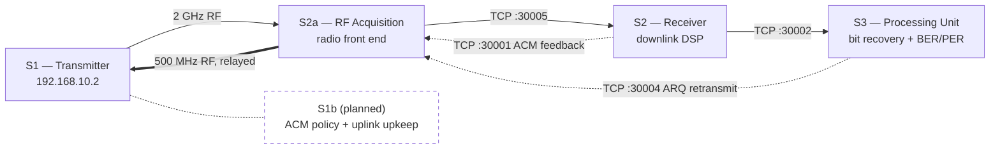

# DVB-S2 Satellite Testbed — Architecture & Function Map

A working inventory of the four processes that make up the testbed's live signal
chain, the fifth planned for the return-link control plane, and the functions
each one calls — organised by role: downlink physical layer, uplink physical
layer, TCP transport, message serialization, and testbed / ACM control.

**Platform:** MATLAB R2026a
**Hardware:** NI USRP-2920 (downlink TX + uplink RX, `192.168.10.2`) · USRP-2922 (`192.168.10.3`)

---

## 1 · System overview

The testbed splits one DVB-S2 forward link and one CCSDS Telecommand return
link across four MATLAB processes, each its own script, talking over TCP on
loopback. Splitting the chain this way means each process can be started
independently, in any order, and — on the hardware runs — each maps onto a
distinct piece of the RF path rather than one script trying to own both
radios at once.

The two radios are not symmetric. **USRP-2920** carries the downlink transmit
chain at 2 GHz *and* the uplink receive chain at 500 MHz — the same physical
device, the same IP address, `192.168.10.2` — because the ground station only
has the one antenna feed on that side. **USRP-2922** is free-standing at
`192.168.10.3`. That constraint is why the uplink receiver stays inside
`S1_Transmitter.m` rather than living in its own process: nothing else is
allowed to open that IP.



All four TCP ports are configured once, in `dvbs2TestbedConfig.m`, as
`host:port` pairs. Which physical process binds a given port changes between
simulated and hardware runs — in RF mode, S2a takes over the two ports S1
used to host directly — but the scripts that connect to them never need to
know that; see [§7](#7--testbed--acm-control--functionstestbed).

---

## 2 · The processes

Four scripts run today, one per MATLAB window, each started independently
and in any order. A fifth is planned but not yet built.

### `S1_Transmitter.m` — Downlink TX
Builds PLFRAMEs from a synthetic packet stream under adaptive coding &
modulation, queues them into a transmit FIFO, and drives the downlink USRP
at 2 GHz. Owns MODCOD selection from the ACM feedback it receives, and
services selective-repeat ARQ retransmit requests ahead of new data, without
pausing the new-data budget.
Ports: TX 2 GHz (`192.168.10.2`), RX 500 MHz (shared IP).

### `S2a_RFAcquisition.m` — Downlink front end
The only process that touches the receive radio. Runs DC-offset/AGC
conditioning on the raw 2 GHz samples and forwards fixed-length chunks to S2
for DSP. In hardware mode it also becomes the return-link gateway: it hosts
the ACM-feedback and retransmit-request listeners and relays whatever
arrives on them, verbatim, over the 500 MHz uplink carrier to S1.
Ports: server `:30005`, server `:30001`\*, server `:30004`\*.

### `S2_Reciever.m` — Downlink DSP
The physical-layer receive chain: frame sync, matched filtering with Gardner
timing recovery, coarse/fine CFO estimation, PLHEADER/PLSC recovery,
pilot-aided phase compensation, per-frame SNR estimation, and the
frame-acceptability screen. Hands off corrected PLFRAMEs to S3 and reports
channel quality back toward S1.
Ports: client `:30001`, client `:30002`.

### `S3_ProcessingUnit.m` — Bit recovery
LDPC/BCH decoding and BBHEADER/packet extraction, plus the testbed's
independent measurement point: per-packet CRC-8, and self-synchronizing
BER/PER against a deterministic reference payload. Detects gaps and CRC
failures and drives the selective-repeat ARQ logic that requests their
retransmission.
Ports: server `:30002`, client `:30004`.

### `S1b` *(planned, not yet implemented)*
Proposed split-out of ACM policy management and part of the uplink
control-plane housekeeping from S1, so the downlink generation loop stops
competing with return-link bookkeeping on one process. S1 keeps sole
ownership of the shared-IP radio — that part cannot move. Deferred pending
confirmation the current single-process load needs it.

\* In simulated (non-RF) mode these two servers are hosted by S1 directly,
and S2a's radio/relay code does not run at all.

---

## 3 · Downlink functions — `Functions/*.m`

The forward-link DSP chain, called mainly from `S2_Reciever.m`: everything
between a raw 2 GHz sample stream and a corrected, measured PLFRAME ready
for bit recovery.

| Function | Role |
|---|---|
| `dvbs2FrameSync.m` | Locates the PLHEADER start via differential correlation against the reference SOF. |
| `dvbs2SOFReference.m` | Reference SOF (Start Of Frame) symbols used by frame sync. |
| `dvbs2MatchedFilterTimingSync.m` | Matched filtering plus Gardner symbol-timing recovery. |
| `dvbs2DCBlock.m` | Removes LO-leakage / DC offset from raw receive samples. |
| `dvbs2RawCFOCompensate.m` | Raw-sample-domain coarse CFO estimate/correction. Disabled in the current configuration. |
| `dvbs2CoarseFreqEst.m` | Two-stage coarse carrier-frequency-offset estimate. |
| `lrEstimate.m` | Multi-lag Luise & Reggiannini normalized frequency estimator, used by the coarse/fine CFO stages. |
| `dvbs2FineFreqEst.m` | Pilot-aided fine carrier-frequency-offset estimate. |
| `dvbs2CFOTracker.m` | Closed-loop alpha-beta tracker that follows the carrier frequency offset across frames. |
| `dvbs2PLHeaderRecover.m` | PLHEADER (PLSC) recovery, specialised for plain DVB-S2. |
| `dvbs2PLHeaderReference.m` | Cached, ideal 90-symbol PLHEADER for a decoded PLS code. |
| `dvbs2FrameAcceptable.m` | Temporary rejection gate: discards PLHEADER decodes reporting no pilots, an unsupported MODCOD, or a short FECFRAME. |
| `dvbs2FrameLength.m` | Total PLFRAME length in symbols, including pilots. |
| `dvbs2PilotStructure.m` | Generates pilot symbol positions and their reference values for one PLFRAME. |
| `dvbs2PhaseCompensate.m` | Pilot-aided phase-trajectory correction, anchored on the whole PLHEADER (SOF + PLSC). |
| `dvbs2NonPilotFineFreqPhase.m` | Fine CFO/phase correction for PLFRAMEs sent without pilots. |
| `dvbs2SNREstimate.m` | Cross-checked per-frame SNR (pilot- and header-derived), used for ACM and for LDPC LLR scaling. |
| `dvbs2DummyFiller.m` | Pulse-shaped dummy PLFRAMEs that keep the carrier continuously fed between real bursts. |
| `AEC_dvbs2BitRecover.m` | Descrambling, LDPC/BCH decoding, and BBHEADER/packet extraction from one corrected PLFRAME. |
| `getDFL.m` | DVB-S2 Data Field Length for a given MODCOD/FECFRAME combination. |
| `configureDVBS2Channel.m` | Simulation-only channel model: applies CFO, SCO, phase noise and AWGN to a waveform. |

---

## 4 · Uplink functions — `Functions/Uplink/*.m`

The return link is CCSDS Telecommand over PLOP-2 at 500 MHz: a continuous
BPSK/NRZ-L carrier with a 16 kHz subcarrier, 4000 sym/s, carrying
LDPC(128,64)-coded CLTUs. Stages are numbered to match their position in the
receive chain.

| Function | Role |
|---|---|
| `ccsdsUplinkTCConfig.m` | Builds the CCSDS TC format object from the shared testbed configuration. |
| `ccsdsUplinkCommand.m` | Builds one uplink command payload (a channel report or a retransmit request). |
| `ccsdsUplinkParseCommand.m` | Decodes one uplink command payload back into its fields. |
| `ccsdsUplinkRandomizer.m` | The CCSDS Telecommand randomizing (scrambling) sequence. |
| `ccsdsUplinkFraming.m` | Everything the receiver must know about how the CLTU sits on the air: start sequence, tail, lengths. |
| `ccsdsUplinkLDPCMatrix.m` | Parity-check matrix for the CCSDS TC LDPC(128,64) code. |
| `ccsdsUplinkSymbols.m` | Generates one PLOP-2 element as BPSK symbols. |
| `ccsdsUplinkPulseShape.m` | Root-raised-cosine pulse shaping for the continuous uplink carrier. |
| `ccsdsUplinkTxStream.m` | The PLOP-2 transmit state machine: idle sequence between CLTUs, queued commands, continuous phase. |
| `ccsdsUplinkDCSuppress.m` | **Stage 1** — removes LO leakage from the received uplink stream. |
| `ccsdsUplinkCoarseCFO.m` | **Stage 2a** — acquires the carrier offset by squaring. |
| `ccsdsUplinkMatchedFilter.m` | **Stage 3** — root-raised-cosine matched filter. |
| `ccsdsUplinkGardner.m` | Optional symbol-timing recovery loop, between stages 3 and 4. |
| `ccsdsUplinkASMDetect.m` | **Stage 4** — finds the CLTU start sequence and, with it, symbol/frame alignment. |
| `ccsdsUplinkCostas.m` | **Stage 5** — tracks the residual carrier phase across the burst. |
| `ccsdsUplinkDecodeCodeblock.m` | **Stages 6–7** — derandomizes, then LDPC-decodes one codeblock. |
| `ccsdsUplinkReceive.m` | Orchestrates stages 1–7 end to end: the whole uplink receiver. |

---

## 5 · TCP transport — `Functions/TCP/*.m`

A small framing layer shared by every inter-process link. Each message is a
4-byte little-endian length prefix followed by that many payload bytes, so a
message of any size can be told apart from the next one on the same stream.

| Function | Role |
|---|---|
| `dvbs2TCPServerRetry.m` | Opens a `tcpserver`, retrying while the port is still held from a previous run. |
| `dvbs2TCPConnectRetry.m` | Connects as a `tcpclient`, retrying until the far side is listening — what lets every script start in any order. |
| `dvbs2TCPFrameWrite.m` | Writes one length-prefixed message. |
| `dvbs2TCPFrameRead.m` | Blocking read of one length-prefixed message. |
| `dvbs2TCPFrameTryRead.m` | Non-blocking check for one complete message; returns empty immediately if none has arrived. |
| `dvbs2TCPIsConnected.m` | Best-effort connection check that works for either a `tcpserver` or a `tcpclient` handle. |

---

## 6 · Message serialization — `Functions/Serialization/*.m`

One pack/unpack pair per message type that crosses a process boundary, so
every script reads and writes the same on-wire layout without duplicating
the bit-packing logic.

| Function | Role |
|---|---|
| `dvbs2SerializePLFrame.m` / `dvbs2DeserializePLFrame.m` | Corrected PLFRAME + PLHEADER metadata, for the S2 → S3 hand-off. |
| `dvbs2SerializeAcqChunk.m` / `dvbs2DeserializeAcqChunk.m` | One acquisition chunk (samples + scalars), for the S2a → S2 link. |
| `dvbs2SerializeFeedback.m` / `dvbs2DeserializeFeedback.m` | ACM feedback report (mean/sigma SNR, RSSI). |
| `dvbs2SerializeRetransmitRequest.m` / `dvbs2DeserializeRetransmitRequest.m` | Selective-repeat ARQ request, packed compactly. |
| `dvbs2SendRetransmitRequest.m` | Serializes and writes one ARQ request, reporting whether the write actually succeeded. |
| `dvbs2MessageType.m` | Reads the 3-bit type field at the head of a control message — how the shared uplink carrier tells a feedback report from a retransmit request. |
| `dvbs2ComplexToBytes.m` / `dvbs2BytesToComplex.m` | Complex sample vectors as interleaved real/imaginary double bytes, and back. |
| `dvbs2PackBits.m` / `dvbs2UnpackBits.m` | Bit vector to/from a `uint8` array, MSB first. |
| `dvbs2ParseLDPCRate.m` | Parses an LDPC code-rate identifier such as `"1/4"` into numerator/denominator integers. |

---

## 7 · Testbed & ACM control — `Functions/Testbed/*.m`

Everything specific to running this testbed rather than to the
DVB-S2/CCSDS standards themselves: shared configuration, the
adaptive-coding-and-modulation policy, and the synthetic traffic the link
carries so BER/PER can be measured at all.

| Function | Role |
|---|---|
| `dvbs2TestbedConfig.m` | Single shared configuration — hosts/ports, hardware settings, MODCOD set, run duration — read by all four (five) scripts. |
| `dvbs2ACMPolicy.m` | Recommends a MODCOD from batched SNR statistics, with hysteresis and a minimum dwell time. |
| `dvbs2SelectMODCOD.m` | Picks the highest MODCOD supportable under a variability-aware SNR bound (mean minus a margin for sigma). |
| `dvbs2ReferencePacketPayload.m` | Deterministic, self-synchronizing test-packet payload — what lets S3 measure BER without replaying a shared RNG. |
| `dvbs2GeneratePacketBurst.m` | Builds a serialized packet bitstream for an explicit list of packet indices, used for both new data and retransmit bursts. |

### How ACM works

Adaptive coding and modulation is one pipeline split across three places:
S2 measures and reports, `dvbs2ACMPolicy.m` / `dvbs2SelectMODCOD.m` decide,
and S1 carries out the switch. Each stage exists to solve a specific
failure the simpler version of it produced on real hardware.

**1 · Measuring and batching SNR — S2.**
Every decoded frame yields one SNR estimate from `dvbs2SNREstimate.m`,
which accumulates into a batch. Before anything is sent, `localBatchStats`
reduces that batch to a mean and a standard deviation — and does so
carefully, because the estimator itself misfires: measured on hardware,
roughly 4% of otherwise perfect frames return a wildly wrong SNR (one
logged case: peak 0.988, correct PLS, SNR &minus;3.14 dB against a true
16.5 dB). Outliers are rejected by the **median absolute deviation**, not
the standard deviation — the very outlier being screened for is what
inflates σ, so screening with σ defeats itself. The batch is also reduced
to **population** variance (divide by N, not N&minus;1), because the
recombination formula used downstream is only exact for the population
form.

**2 · When a report is actually sent — S2.**
Reporting is event-driven, not periodic, because a periodic trigger tied to
frame count is wrong twice over: it isn't tied to anything physical, and it
*speeds up* exactly when the channel is best and least worth reporting on,
since frames get shorter as MODCOD rises. The real cadence of channel
change is much slower — a 10-minute LEO pass with 16 dB of dynamic range
moves at roughly 0.09 dB/s at its steepest, and MODCOD rungs sit
0.6&ndash;1.2 dB apart, so the channel needs 7&ndash;13 seconds to justify
even one step. A report fires when any of three conditions holds:

| Trigger | Condition |
|---|---|
| mean moved | batch mean has shifted > 0.5 dB since the last report sent |
| sigma moved | batch standard deviation has shifted > 0.5 dB |
| heartbeat | 2.0 s have elapsed with nothing else to say |

The mean/sigma triggers only fire once the batch holds at least 3 frames —
a batch of one has no MAD to check itself against, so a single bad estimate
would otherwise trip "the mean moved," get reported as fact, and reach the
policy as a genuine sample. The heartbeat is deliberately exempt from that
minimum: it has a different job, proving the receiver is alive at all —
including when it has decoded nothing. That is what makes **silence itself
informative**: if S1 hears nothing within `linkLossSec` (5 s), the only
possible reading is that the channel is still within 0.5 dB of the last
report, not that anything has failed.

**3 · Selecting a MODCOD from the statistics — `dvbs2SelectMODCOD.m`.**
One function is the sole point of contact with the MODCOD ladder, so the
bootstrap (link establishment) and steady-state paths can never disagree
about how to read the same numbers. It walks the ladder and keeps the
highest rung whose published quasi-error-free Es/N0 threshold still clears
a deliberately pessimistic bound:

```
bound = mu − max(k·sigma, marginFloor) + trendAdj
```

Using σ rather than a fixed dB margin matters: a fixed margin is
simultaneously too small on a volatile link (the mean sits above threshold
only half the time by definition) and needlessly large on a calm one.
Scaling by the *measured* standard deviation gives k a concrete meaning —
for a roughly normal distribution, k = 1 keeps the link above threshold
~84% of the time, k = 2 ~97.7%. The MODCOD already in use gets a relaxed k
(`sigmaKStay`, 0.5) rather than the standard one (`sigmaK`, 1.0) — the
anti-flapping mechanism: a rung already running isn't abandoned the moment
σ nudges its bound a hair below threshold, but a *candidate* rung has to
clear the stricter bar to be worth switching to.

`trendAdj` only ever pushes the bound down. The least-squares slope of
recent batch means is extrapolated 3 seconds ahead, but only when it is
**falling** — a rising slope is ignored, because assuming SNR you have not
actually observed yet is the mistake that costs frames, while being
slightly late to move up only costs throughput.

> **Caveat.** σ cannot separate genuine channel variation from the
> estimator's own noise — sparse pilot blocks alone produce real
> frame-to-frame spread even on a channel that is not moving at all.
> Because the two can't be told apart, k is set conservative by default
> rather than tuned aggressively, and should only be raised if the
> measured packet error rate says it is actually needed.

**4 · The rolling policy and its hysteresis — `dvbs2ACMPolicy.m`.**
Every feedback report folds into a rolling window of up to 10 batches. The
window is combined **exactly**, not approximately — given each batch's own
n, μ, σ, the combined statistics reproduce precisely what the same formula
would give from the raw per-frame samples:

```
n     = Σ nᵢ
mu    = Σ(nᵢ·μᵢ) / n
sigma² = Σ(nᵢ·(σᵢ² + μᵢ²)) / n − mu²
```

which is the whole reason a 5-byte report loses nothing: compressing "N
frames' worth of statistics" into one small message doesn't discard
anything the policy will later need.

The asymmetry between climbing and dropping the ladder appears three
separate times:

| Mechanism | Moving up | Moving down |
|---|---|---|
| agree count | 3 consecutive reports must agree | 1 report is enough |
| minimum dwell | 5 s since the last switch | 0 s required |
| jump cap | capped at 3 rungs per decision (`maxJumpRungs`) | never capped |

The reasoning is the same each time: sitting one rung lower than the
channel could support only wastes throughput, but sitting one rung higher
loses real frames on every single one of them until the policy reacts — so
climbing is made deliberately slow to trust, and falling is made as fast as
physically possible.

A `Count = 0` report — "alive, but decoded nothing" over a whole heartbeat
interval — bypasses all of this. It carries no usable statistics, so it
isn't folded into the window; instead it drops the recommendation straight
to the lowest MODCOD in one step. Without that short-circuit, a zero-count
report would simply add nothing to the window and fall through to the
normal path, which could let a pending *upgrade* that earlier good reports
had been building toward mature at exactly the moment the receiver proved
it could decode nothing at the current rung.

**5 · Link establishment — the cold start.**
The very first feedback message S1 ever receives is treated differently:
with no current MODCOD and no history to protect, S1 calls
`dvbs2SelectMODCOD` directly on that first batch's own mean and sigma
(trend term forced to zero) to pick a starting rung, then hands control to
the steady-state policy from the next report onward. Routing the bootstrap
through the same function the steady-state policy uses is deliberate —
there is exactly one place that reads the MODCOD ladder, so the two paths
cannot drift into disagreeing about what a given SNR supports.

**6 · What a switch actually costs — S1.**
At the switch itself, only the waveform-generator object is released and
reconfigured:

```matlab
release(cfgDVBS2);
cfgDVBS2.MODCOD = recommendedMODCOD;
cfgDVBS2.DFL    = getDFL(recommendedMODCOD, cfgDVBS2.FECFrame);
```

The radio transmitter object itself is never released mid-run — its only
`release` call is the `onCleanup` that fires at script end. That matters
because of the transmit FIFO: the radio always consumes fixed-size blocks
regardless of which MODCOD produced the samples currently sitting in the
FIFO, so reconfiguring the waveform generator costs some CPU time but
produces no gap in the transmitted carrier — the FIFO's existing backlog
covers it.

> **Open item.** `dvbs2SelectMODCOD.m`'s own comment justifying the jump
> cap still says "every MODCOD change costs S1 a radio release and
> reopen" — true of the architecture before the transmit FIFO existed, no
> longer true of what the code does today. Not a functional bug, just a
> comment that wants updating to match the current mechanism.

---

## 8 · Hardware bring-up scripts — `sdr_test/`

Standalone commissioning tools, not part of the live flowgraph:
`CheckRadios.m` (confirms both USRPs answer at their configured IPs),
`TX_ToneTest.m` / `RX_ToneTest.m` (single-tone transmit/detect),
`DuplexCapabilityTest.m` and `DuplexPollingTest.m` (whether and how often
one radio can transmit and receive together), `IsolationTest_Near.m` /
`IsolationTest_Far.m` (leakage between the two radios), and the standalone
`UplinkTx.m` / `UplinkRx.m` pair with their no-radio `*Test.m` variants,
which let the CCSDS uplink chain be verified before it was folded into
S1/S2a. `sdrTestConfig.m` holds the shared settings for this group.

> These predate the operational split into S1/S2a/S2/S3 and are kept as a
> reference for re-verifying one radio or one chain in isolation, not as
> something the live system calls.

---

*DVB-S2 satellite ground-segment testbed — Erasmus project, Aarhus
University. Architecture chapter, first draft: process and function
inventory only. Per-function theory and the reasoning behind each design
decision are covered separately, block by block, as later sections.*
